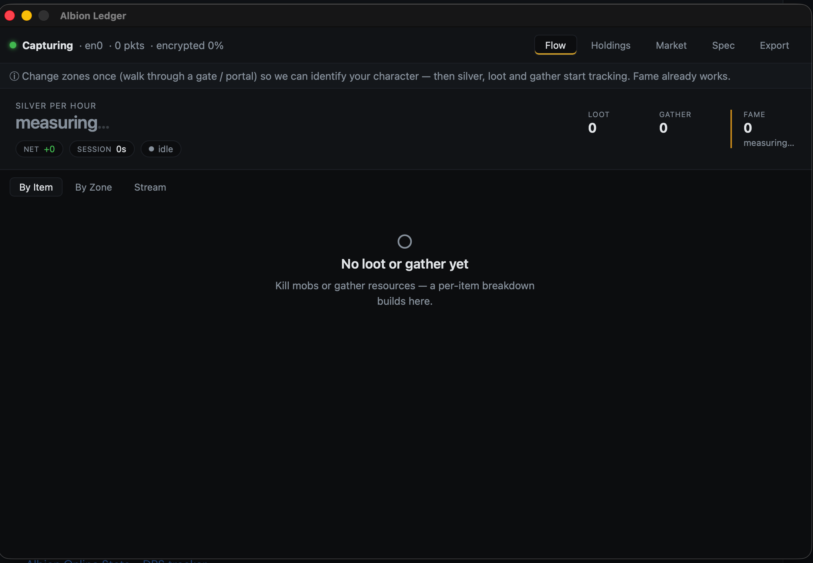

# Albion Ledger

[](https://github.com/epaprat/albion-ledger/releases)
[](LICENSE)
[](#install)

**Albion Ledger** is a passive, **ToS-safe** desktop tool for Albion Online. It reads
the local game network stream — no memory reading, no injection, no automation — and
turns it into a clear answer to *"what do I own, and how much am I earning right now?"*



## What it does

- **Live earnings** — silver, loot, gather, and fame as they happen, with a headline
  **silver/hour** figure so you can see at a glance whether the current activity pays.
- **Zone analytics** — per-zone earning rates over session / today / 7-day / all-time
  windows: a data-driven "where should I farm?".
- **Holdings** — your inventory and every city bank, valued, grouped by city and tab,
  with freshness indicators; the bank overview syncs whole cities from the in-game
  K screen without opening each tab.
- **Valuation** — a layered price model: live marketplace prices where seen, a
  persisted server estimate otherwise, and an optional external fallback.
- **Destiny Board** — your full skill tree decoded from the achievement stream,
  including maxed skills shown correctly at login, organized by gear slot.
- **CSV export** — every dataset (holdings, flow, zones, market, destiny board) exports
  to Excel-compatible CSV, one dataset or all at once.

Every screen has sortable/filterable tables and a designed state for empty, stale,
encrypted, and error conditions.

### Not in scope

Strictly passive: it reads network traffic only — **no** radar/ESP, entity positions,
memory reading, injection, or automation, and nothing that grants a real-time
competitive advantage. It surfaces **market data and your own account data** only, and
your own data stays local unless you explicitly opt in to sharing.

## Install

> **Status.** Live capture is verified on **macOS** today. Windows and Linux binaries
> build but their capture path (Npcap / `cap_net_raw`) is not yet verified — treat them
> as experimental. See [releases](https://github.com/epaprat/albion-ledger/releases).

**Download** the binary for your OS from the
[latest release](https://github.com/epaprat/albion-ledger/releases/latest), or build
from source (below). Live capture needs elevated privileges to read the network
interface.

```sh
# macOS — run with capture privileges
sudo /Applications/albion-ledger.app/Contents/MacOS/albion-ledger -iface en0
```

## Build from source

Requires Go 1.26+, Node 18+, and the [Wails](https://wails.io) v2 CLI.

```sh
git clone https://github.com/epaprat/albion-ledger.git
cd albion-ledger/cmd/albion-ledger
wails build -tags pcap        # live-capture build (omit the tag for a pure-Go build)
sudo ./build/bin/albion-ledger.app/Contents/MacOS/albion-ledger -iface en0
```

See [CONTRIBUTING.md](CONTRIBUTING.md) for tests, the branching model, and the full
development workflow, and [ARCHITECTURE.md](ARCHITECTURE.md) for how the code fits
together.

## Game-patch resilience

Data that the game can change between patches lives in editable files under `data/`
(`items.json` — item catalog; `codes.json` — message-code map). Both are embedded
defaults and reloadable at runtime, so a patch that shifts item names or message codes
is fixed by editing a file, not the source.

## Contributing

Contributions are welcome — please read [CONTRIBUTING.md](CONTRIBUTING.md) and the
[Code of Conduct](CODE_OF_CONDUCT.md). To report a security issue, see
[SECURITY.md](SECURITY.md).

## License

MIT — see [LICENSE](LICENSE).
